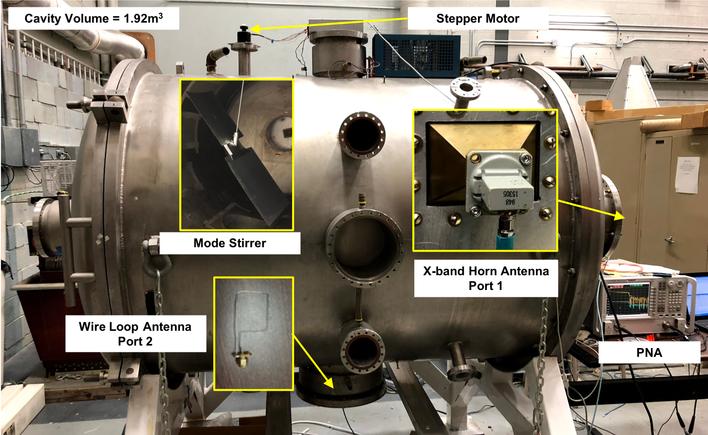

Summary
==========================================================================================
Random Coupling Model (RCM) Measurement and Analysis for Wave Chaotic Cavities. 

Author: Ben Frazier 

Main GIT Repo: https://github.com/UMD-Wave-Chaos/RCM_Measurements.git

RCM Description: http://anlage.umd.edu/RCM/

PNA Online Help: http://na.support.keysight.com/pna/help/latest/help.htm

Haydon Kerk PCM 4826 Online Programming Manual: https://www.haydonkerkpittman.com/-/media/ametekhaydonkerk/downloads/products/drives/idea_drive_communication_manual.pdf?la=en

Acknowledgements
==========================================================================================
Many thanks to Bisrat Addissie, who started this project for his PhD work and provided the baseline code that allowed me to continue.


Version Description
==========================================================================================
The code in this repository includes 2 versions: Matlab and C++, with more detailed descriptions in the following sections. The Matlab version has been tested under Windows XP and the C++ version has been tested under Mac OS Sierra (10.12.6). 


Experimental Setup
==========================================================================================
The wave chaotic cavity used for the experiment is a vacuum chamber that has been repurposed into a reverberation chamber to act as an electromagnetic cavity with a volume of 1.92 cubic meters. A mode stirrer is used to generate different realizations and collect statistics.

The S parameters of the cavity are measured with a PNA-X N5241A vector network analyzer in a 2-port measurements configuration. In the nominal setup, port 1 is connected to an X-band horn antenna at the far end of the cavity and port 2 is connected to a loop antenna at the bottom of the cavity.

The mode stirrer is controlled by a stepper motor, the Aerotech 50SM, which is driven by a Haydon PCM 4826 drive. The motor has 200 full steps per revolution (1.8 degrees per step) and can be driven at 1/64 steps, resulting in 12800 steps (1/64) per revolution.

Both the PNA and stepper motor are controlled through a Windows PC using the Matlab Instrumentation Toolbox. The PNA is connected through either a VISA-TCPIP connection or a GPIB connection and the stepper motor is connected through a serial connection on COM5.



Matlab Version
==========================================================================================
The Matlab has only been tested on Windows due to driver availability. The nominal setup uses a TCP-IP/VISA connection, but it can be modified to use a GPIB connection if needed. 

## Required Software
Matlab version > 2015 with Instrument Toolbox  
Agilent IO Libraries


## Getting Started
Follow the steps below to get started
1. Clone the repository 
2. Open Matlab and cd to the directory containing the repository 
3. Run *start.m* to open the GUI 
4. Select *Edit Config* to open the .xml configuration file in the Matlab editor 
5. Select *Reload Config* to reload the configuration file prior to running
6. If **NOT** using the electronic calibration module, make sure to manually calibrate the PNA 
7. Select *Measure Data* once all Connections are made to take a data set and analyze 
8. Select *Analyze Data* to analyze an existing data set 

Note: The Agilent IO Library Suite provides tools to query the PNA and determine the address to use if this is different from the default setting.

## Potential Connectivity Issues
### 1. Instrument Toolbox Connections Remain Open
Occasionally, the Matlab code will crash with a bug and will not gracefully disconnect from the instrument toolbox connections. When this
happens, the code will throw an error that the instrument is not available and refuse to reconnect. The fix is to either restart Matlab or
force the instrumentation toolbox to close the open devices. You can find the devices through the "instrfind" command:

```
out = instrfind()
```

This will return an array and will indicate whether or not each device is open or closed. All devices that show up as **open** need to be closed
through the fclose command:

```
fclose(out(index));
```
### 2. Serial Port Not Opening
Occasionally, the COM port will remain open after the GUI closes and Matlab will not be able to open it or make a connection. This is a Windows problem that typically occurs when the computer has been powered on for a long time and requires rebooting the machine to fix.


C++ Version
==========================================================================================
The C++ version has only been tested on MacOS and uses the VXI11 protocol to communicate with the PNA over a TCP-IP connection. The GPIB connection is not possible with this version.

## Required Software
The C++ version leverages several open source software packages. On a MacOS, these can all be installed with homebrew (https://brew.sh)  
GRPC: https://grpc.io  
HDF5: https://www.hdfgroup.org  
QT5: https://www.qt.io  
CMake: https://cmake.org  

## Getting Started
Follow the steps below to get started
1. Clone the repository 
2. Open QT Creator and load the CMakeLists.txt file in the cpp folder (/code/cpp/CMakeLists.txt)
3. Build and run the GUI

Note: The available connections through both TCP-IP and serial ports are displayed in the status window when starting up so the address of the PNA and stepper motor can be updated if these are different from the default.

References
==========================================================================================
## Determination of Srad Through Time Gating
1. Addissie et al, “Extraction of the coupling impedance in overmoded cavities”, Wave Motion (2018), https://doi.org/10.1016/j.wavemoti.2018.09.011

2. Addissie et al, "Application of the Random Coupling Model to Lossy Ports in Complex Enclosures", IEEE Metrology for Aerospace (MetroAeroSpace) Conference, 214-219 (2015).

## Reverberation Chamber Measurements
1. Holloway et al, “Reverberation Chamber Techniques for Determining the Radiation and Total Efficiency of Antennas, IEEE Transactions on Antennas and Propagation, 60, 4, 2012

2. Holloway et al, “Early Time Behavior in Reverberation Chambers and its Effect on the Relationships Between Coherence Bandwidth, Chamber Decay Time, RMS Delay Spread, and the Chamber Buildup Time”, IEEE Transactions on Electromagnetic Compatibility, 54,4, 2012

## RCM Theory
1. Zheng et al, "Statistics of Impedance and Scattering Matrices in Chaotic Microwave Cavities: Single Channel Case," Electromagnetics 26, 3 (2006).

2. Zheng et al, "Statistics of Impedance and Scattering Matrices of Chaotic Microwave Cavities with Multiple Ports," Electromagnetics 26, 37 (2006).

3. Hart et al, "Scattering a pulse from a chaotic cavity: Transitioning from algebraic to exponential decay," Phys. Rev. E 79, 016208 (2009).

4. Hart et al, "The effect of short ray trajectories on the scattering statistics of wave chaotic systems," Phys. Rev. E 80, 041109 (2009).

## RCM Measurements
1. Hemmady et al, "Universal Statistics of the Scattering Coefficient of Chaotic Microwave Cavities," Phys. Rev. E 71, 056215 (2005).

2. Hemmady et al, "Universal Impedance Fluctuations in Wave Chaotic Systems," Phys. Rev. Lett. 94, 014102 (2005).

3. Hemmady et al, "Universal Properties of 2-Port Scattering, Impedance and Admittance Matrices of Wave Chaotic Systems," Phys. Rev. E 74 , 036213 (2006).


